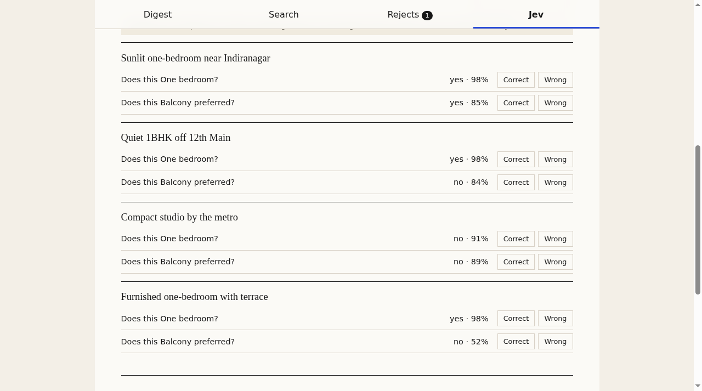
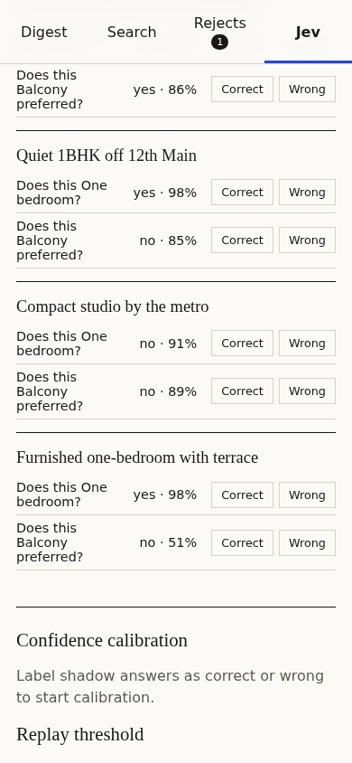

# Cuttings

Cuttings is a small web app for saved searches. Write the conditions once, then open the app later to catch up on new items.

Use Cuttings when you repeatedly check flats, jobs, grants, tenders, used products, or other feeds and want to see:

- **Strong matches**: all required checks passed.
- **Maybes**: a preferred check missed, information is missing, or the answer is uncertain.
- **Rejects**: a required check failed. Rejects stay visible so you can correct the search.

Searches are saved in your browser, so they survive a refresh. One live source (Hacker News) is included, and Jev can check meaning questions in shadow mode.

**Live app:** https://dcr6174.github.io/cuttings/

## Core mode and Jev mode

### Core mode

Core mode needs no API key. It uses deterministic code for facts such as:

- price or amount
- published date
- deadline
- known fields

If the app cannot safely compare a value, it says so. It does not guess.

### Jev shadow mode

Jev can answer narrow meaning questions such as "Does this flat mention a balcony?"

In Phase 3, Jev runs in **shadow mode**:

1. Ranking always stays keyless. Jev answers never change strong, maybe, or reject.
2. Every Jev answer is stored as replayable provenance: the question, criteria, threshold, model version, raw answer, confidence, and time.
3. You label answers as correct or wrong. The app then shows how often Jev agrees with you, bucketed by confidence, and lets you replay the accept line at any threshold.

This is how trust is earned before Jev is allowed to influence ranking in a later phase.

Jev calls go through a small Cloudflare Worker proxy. The TypeSafe API key lives only on that server as an encrypted secret. No key is typed, saved, or sent from the browser. See **The Jev proxy** below.

## What you need

- Node.js 22 or newer
- npm, which is included with Node.js
- Git, only if you want to clone the repository

Check Node and npm:

```sh
node --version
npm --version
```

## Install and run

```sh
git clone https://github.com/dcr6174/cuttings.git
cd cuttings
npm install
npm run dev
```

Vite prints a local address, normally `http://localhost:5173/cuttings/`. Open it in your browser.

To stop the app, press `Ctrl+C` in the terminal.

## First working example

1. Run the app.
2. Open the **Search** tab and choose **Flats near Indiranagar**. It uses the offline sample feed.
3. Keep these conditions:

```text
Under ₹30,000 per month
Posted within the last 2 days
One bedroom
Balcony preferred
```

4. Open **Digest**.

Expected sample result:

```text
Strong matches: 1
Maybes: 2
Rejects: 1
```

The strong match is **Sunlit one-bedroom near Indiranagar** at **₹28,000 / month**.

## Create or edit a search

1. Open **Search**.
2. Pick a saved search, or press **New**.
3. Choose a source: the offline sample feed or the live Hacker News source. For the live source, type the words to search for.
4. Edit a condition directly in its text field.
5. Use **Add a condition** to add another rule. Use **×** to remove one.
6. Read the label above each rule:
   - **Exact** means local code can check it.
   - **Meaning** means a semantic evaluator is needed.
   - **Needs attention** means the parser found something unclear.
7. Open **Digest** to inspect strong matches and maybes.
8. Open **Rejects** to inspect failed rules. Use **This should be a maybe** to mark a result for correction.

Every change is saved in this browser automatically. Refresh the page and the searches are still there.

## The live Hacker News source

The app includes one legitimate live source: the official Hacker News API provided by Algolia (`https://hn.algolia.com/api`). It is public, needs no key, and allows browser access.

- Stories are converted into the small `Item` shape in `src/types.ts`.
- The original story URL and "Hacker News" source name are preserved.
- Fields the source does not supply, such as price, stay empty. Exact price checks then report "could not check" and the item becomes a maybe. The app never invents data.

## How catch-up works

Cuttings is local-first:

1. A saved search keeps its source, query, and conditions in your browser.
2. When you open it, the source adapter requests current items.
3. Exact checks run first.
4. Required exact failures are rejected before any semantic work.
5. Remaining results become strong matches, maybes, or rejects.

Cuttings is not an always-on background service yet. It catches up when you open it.

## Use Jev shadow mode

1. Open the **Jev** tab.
2. The proxy address is already filled in: `https://cuttings-jev-proxy.dcr6174.workers.dev`. No API key is needed in the browser.
3. Press **Run shadow check**. Jev answers the search's meaning questions for up to 10 items, batched four questions per call through the proxy.
4. Mark each answer **Correct** or **Wrong**.
5. Watch the calibration summary: agreement percentage and accuracy by confidence bucket.
6. Move the replay threshold to see how many stored answers would be accepted at each level.
7. Use **Download provenance JSON** to keep the full replayable record.

The keyless digest keeps working even if the shadow run fails.

## The Jev proxy

The browser never talks to TypeSafe directly. It calls a Cloudflare Worker, and the Worker adds the secret key:

```text
Browser  -->  https://cuttings-jev-proxy.dcr6174.workers.dev  -->  TypeSafe API
                                   (key lives here only)
```

The Worker is strict on purpose. It allows only:

- requests from `https://dcr6174.github.io` (every other origin gets a 403)
- `POST` to `/v1/systemone` (anything else gets a 404 or 405)
- a body up to 16 KB
- the fixed model `jev-latest`
- 1 to 4 boolean questions per call, with capped question, field, and state sizes
- no unexpected top-level fields (they are rejected with a 400)

The key is stored as the encrypted Worker secret `TYPESAFE_JEV_KEY`. It is never in the repository, the app bundle, or the browser.

Measured on the live deployment: model `jev-1.13.0`, 365 input + 21 output tokens for one question on one flat, about 0.26 seconds end to end through the proxy. A full shadow run over 4 sample flats with 2 questions each returns in a few seconds.

The Worker source is `worker/proxy.ts`, tested by `test/proxy.test.ts`.

### Deploy the proxy yourself

You need a free Cloudflare account.

Option A, with wrangler:

```sh
cd worker
npm install --global wrangler   # or: npx wrangler --version
npx wrangler login
npx wrangler deploy --config wrangler.toml
npx wrangler secret put TYPESAFE_JEV_KEY   # paste the key when asked
```

Option B, in the Cloudflare dashboard:

1. Build the single-file bundle: `npx esbuild worker/proxy.ts --bundle --format=esm --outfile=/tmp/proxy.js`
2. Open **Workers & Pages → Create → Worker**, paste the bundle into the editor, and deploy.
3. Open **Settings → Variables and Secrets**, add a secret named `TYPESAFE_JEV_KEY` with your TypeSafe key.
4. If your Worker name differs, update the allowed origin or the default proxy address in `src/App.tsx`.

### What a working shadow run looks like

Desktop and mobile runs against the live proxy:





Each row is one meaning question answered by the real Jev model, with its confidence. The digest ranking does not change.

## Add a legitimate source adapter

Do not add fragile portal scraping to the official project. Use a feed or API you are allowed to use.

For each adapter:

1. Confirm that the source permits API or feed access.
2. Document the source URL, permission or terms, authentication, and rate limits.
3. Convert source records into the small `Item` shape in `src/types.ts`.
4. Preserve the original item URL and source name.
5. Store only fields the source supplies. Do not invent missing amounts or dates.
6. Add saved fixtures for offline tests.
7. Test pagination, duplicate IDs, missing fields, rate limits, and errors.
8. Run the full check before opening a pull request.

## Tests and production build

Run everything:

```sh
npm run check
```

This runs TypeScript checks, 116 tests, and a production build.

Run one part:

```sh
npm run typecheck
npm test
npm run build
```

A successful build creates `dist/`.

## No API key behavior

You do not need a key to run the app, parser, exact engine, tests, sources, or sample UI.

Without Jev:

- exact conditions still work
- semantic conditions cannot be confirmed by a live model
- uncertain or unavailable semantic answers must remain **Maybe**
- tests use the deterministic fixture evaluator

Do not put API keys in the repository, source code, screenshots, issues, or chat.

## Deploy

The public app deploys with GitHub Pages and GitHub Actions.

For this repository:

1. Open **Settings → Pages**.
2. Set **Source** to **GitHub Actions**.
3. Push to `main`.
4. Open **Actions → Deploy web app** and wait for a green run.
5. Open https://dcr6174.github.io/cuttings/.

The workflow is `.github/workflows/deploy.yml`. It installs locked dependencies, runs all checks, builds `dist/`, and deploys that folder.

The Jev proxy deploys separately as a Cloudflare Worker. See **The Jev proxy → Deploy the proxy yourself**. The app works without it; only Jev shadow checks need the proxy.

## Common problems

### `node: command not found`

Install Node.js 22 or newer, then open a new terminal.

### `npm install` reports a dependency conflict

Make sure you pulled the latest `package.json` and `package-lock.json`, then run:

```sh
rm -rf node_modules
npm install
```

Do not use `--force` as the first fix.

### The page is blank or assets return 404

Run `npm run build`. The Vite base path must remain `/cuttings/` in `vite.config.ts` for this GitHub Pages URL.

### GitHub Actions fails in `configure-pages`

Enable Pages first: **Settings → Pages → Source → GitHub Actions**. The workflow also requests Pages enablement for a new repository.

### A condition says "Needs attention"

Rewrite it with one clear comparison. Example: change `budget 30000` to `Under ₹30,000 per month`.

### The live source shows an error

The Hacker News API may be down or unreachable. The sample feed keeps working offline. Your searches and labels are not lost.

### Shadow mode fails with a 401

The Worker's `TYPESAFE_JEV_KEY` secret is missing or wrong. Set it again on the server (see **Deploy the proxy yourself**). The keyless digest is unaffected.

### Shadow mode fails with a 403

The request did not come from the allowed origin. The proxy only accepts `https://dcr6174.github.io`. If you run the app locally, allow `http://localhost:5173` in `worker/proxy.ts` while testing, or expect the 403.

### Shadow mode fails with a 400 or 404

A 400 means the app sent something the proxy refuses (too many questions, an unexpected field, or a body over 16 KB). Update the app, not the proxy. A 404 means the proxy address or path is wrong; the only valid path is `/v1/systemone`.

## Project map

- `src/App.tsx`: mobile-first UI, digest, search editor, rejects, Jev tab
- `src/style.css`: editorial layout, motion, and reduced-motion support
- `src/parser.ts`: condition parser
- `src/engine.ts`: deterministic checks and ranking
- `src/fixture-evaluator.ts`: keyless semantic test evaluator
- `src/jev.ts`: TypeSafe Jev shadow evaluator
- `src/calibration.ts`: confidence calibration and threshold replay
- `src/sources.ts`: source adapters, including live Hacker News
- `src/sample-feed.ts`: offline sample flats feed and fixtures
- `src/store.ts`: browser persistence for searches, provenance, and labels
- `docs/conditions.md`: parser and UI contract
- `worker/proxy.ts`: the Cloudflare Worker that hides the TypeSafe key behind strict request rules
- `test/`: parser fixtures plus engine, source, store, Jev, calibration, and proxy tests

## Current status

Phase 3 working web app, live at https://dcr6174.github.io/cuttings/. Searches persist in the browser, one legitimate live source is included, and Jev runs in shadow mode with replayable provenance and calibration. Real Jev answers are served through the deployed Cloudflare Worker proxy; the key never leaves the server. Jev answers do not influence ranking yet. Cuttings is not an always-on background service.
