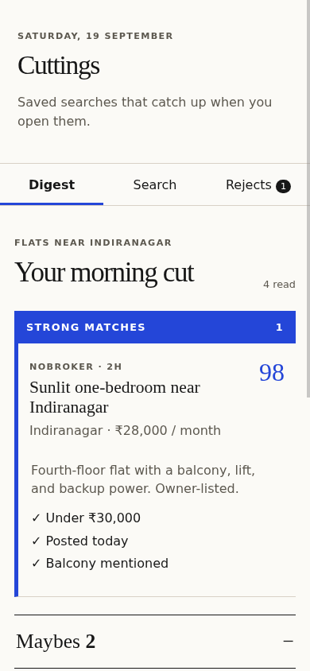
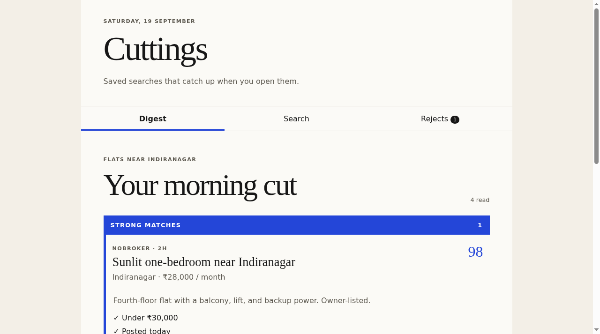

# Cuttings

Cuttings is a small web app for saved searches. Write the conditions once, then open the app later to catch up on new items.

Use Cuttings when you repeatedly check flats, jobs, grants, tenders, used products, or other feeds and want to see:

- **Strong matches**: all required checks passed.
- **Maybes**: a preferred check missed, information is missing, or the answer is uncertain.
- **Rejects**: a required check failed. Rejects stay visible so you can correct the search.

The current app is a Phase 2 demo. It uses a local sample flats feed. It does not run in the background and it does not contact Jev yet.

**Live app:** https://dcr6174.github.io/cuttings/

## See the app

Mobile:



Desktop:



## Core mode and Jev mode

### Core mode

Core mode needs no API key. It uses deterministic code for facts such as:

- price or amount
- published date
- deadline
- known fields

If the app cannot safely compare a value, it says so. It does not guess.

### Jev mode

Jev mode is planned for a later phase. It will answer narrow meaning questions such as "Does this flat mention a balcony?"

Jev will be optional. Low-confidence answers will go to **Maybe**. Exact prices and dates will still be checked by code.

## What you need

- Node.js 22 or newer
- npm, which is included with Node.js
- Git, only if you want to clone the repository

Check Node and npm:

```sh
node --version
npm --version
```

## Install and run

```sh
git clone https://github.com/dcr6174/cuttings.git
cd cuttings
npm install
npm run dev
```

Vite prints a local address, normally `http://localhost:5173/cuttings/`. Open it in your browser.

To stop the app, press `Ctrl+C` in the terminal.

## First working example

1. Run the app.
2. Open the **Search** tab.
3. Keep these conditions:

```text
Under ₹30,000 per month
Posted within the last 2 days
One bedroom
Balcony preferred
```

4. Open **Digest**.

Expected sample result:

```text
Strong matches: 1
Maybes: 2
Rejects: 1
```

The strong match is **Sunlit one-bedroom near Indiranagar** at **₹28,000 / month**.

## Create or edit a search

The current demo has one editable sample search.

1. Open **Search**.
2. Edit a condition directly in its text field.
3. Use **Add a condition** to add another rule.
4. Use **×** to remove a rule.
5. Read the label above each rule:
   - **Exact** means local code can check it.
   - **Meaning** means a semantic evaluator is needed.
   - **Needs attention** means the parser found something unclear.
6. Open **Digest** to inspect strong matches and maybes.
7. Open **Rejects** to inspect failed rules. Use **This should be a maybe** to see the correction-loop action in the demo.

Search changes currently live in memory only. Refreshing the page resets the demo.

## How catch-up works

Cuttings v1 is local-first:

1. A saved search keeps the time of its last run.
2. When you open it, a source adapter requests newer items.
3. Exact checks run first.
4. Required exact failures are rejected before any semantic work.
5. Remaining results become strong matches, maybes, or rejects.

The Phase 2 UI uses sample data and shows a sample last-run time. Persistent saved searches and a live source adapter are Phase 3 work. Cuttings is not an always-on background service yet.

## Add a legitimate source adapter

Do not add fragile portal scraping to the official project. Use a feed or API you are allowed to use.

For each adapter:

1. Confirm that the source permits API or feed access.
2. Document the source URL, permission or terms, authentication, and rate limits.
3. Convert source records into the small `Item` shape in `src/types.ts`.
4. Preserve the original item URL and source name.
5. Store only fields the source supplies. Do not invent missing amounts or dates.
6. Add saved fixtures for offline tests.
7. Test pagination, duplicate IDs, missing fields, rate limits, and errors.
8. Run the full check before opening a pull request.

## Tests and production build

Run everything:

```sh
npm run check
```

This runs TypeScript checks, 73 tests, and a production build.

Run one part:

```sh
npm run typecheck
npm test
npm run build
```

A successful build creates `dist/`.

## No API key behavior

You do not need a key to run the app, parser, exact engine, tests, or sample UI.

Without Jev:

- exact conditions still work
- semantic conditions cannot be confirmed by a live model
- uncertain or unavailable semantic answers must remain **Maybe**
- tests use the deterministic fixture evaluator

Do not put API keys in the repository, source code, screenshots, issues, or chat.

## Deploy

The public app deploys with GitHub Pages and GitHub Actions.

For this repository:

1. Open **Settings → Pages**.
2. Set **Source** to **GitHub Actions**.
3. Push to `main`.
4. Open **Actions → Deploy web app** and wait for a green run.
5. Open https://dcr6174.github.io/cuttings/.

The workflow is `.github/workflows/deploy.yml`. It installs locked dependencies, runs all checks, builds `dist/`, and deploys that folder.

## Common problems

### `node: command not found`

Install Node.js 22 or newer, then open a new terminal.

### `npm install` reports a dependency conflict

Make sure you pulled the latest `package.json` and `package-lock.json`, then run:

```sh
rm -rf node_modules
npm install
```

Do not use `--force` as the first fix.

### The page is blank or assets return 404

Run `npm run build`. The Vite base path must remain `/cuttings/` in `vite.config.ts` for this GitHub Pages URL.

### GitHub Actions fails in `configure-pages`

Enable Pages first: **Settings → Pages → Source → GitHub Actions**. The workflow also requests Pages enablement for a new repository.

### A condition says “Needs attention”

Rewrite it with one clear comparison. Example: change `budget 30000` to `Under ₹30,000 per month`.

### Search edits disappear after refresh

That is expected in the Phase 2 demo. Browser persistence is not connected yet.

## Project map

- `src/App.tsx`: mobile-first demo UI and sample feed
- `src/style.css`: editorial layout, motion, and reduced-motion support
- `src/parser.ts`: condition parser
- `src/engine.ts`: deterministic checks and ranking
- `src/fixture-evaluator.ts`: keyless semantic test evaluator
- `docs/conditions.md`: parser and UI contract
- `test/`: 66 parser fixtures and 7 engine/pipeline tests

## Current status

Phase 2 working web app. Local sample feed only. Jev and one legitimate live feed/API come next.
